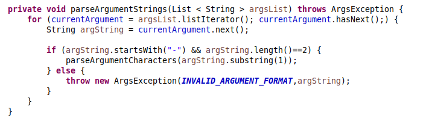

# SE_Assignement1
SOFTWARE ENGINEERING

Assignment – 1 (Clean The Code)

M.Tech CSE
Roll No : 2019201043

1) **EXPLANATION OF IMPLEMENTED FEATURES[EXISTING]**:

      - ArgsMain is basically an StringParser which parse the argument String based on Schema

      - Schema Terminologies: 
          character - boolean argument 
          character*	- String argument 
          character# - Integer argument 
          character## - Double argument 
          character[*]  - String array 
          character&  - Map 

      - ArgsMain creates ArgumentParser class object which parse the schema and Input argument string.

      - While Parsing the schema correspoding to each character and type, object of correspoding Argument type class is created and inserted in map.

      - For each type of data type, Classes with set and get methods implemented using Interface
      ex: for boolean, booleanArgument class with member as boolean variable.

      - While pasing argument string, corresponding reference of object is pulled from map and value set to that object.

      - Example:
        Schema: “x,y*” Arguments: “-x -y IIITH”
        1) Parse schema and create objects i.e,
        x->&BooleanArgument obj 
        y->&StringArgument obj
        2) Parse argument string
        x->pull reference object correspoding to Boolean and set TRUE
        y->pull reference object correspoding to String and set value = nextOfCurrentArgument i.e IIITH.

2) **INSTRUCTIONS**:

      - Instructions on requirements: 
          - Java for Ubuntu/Windows 
          - Java IDE (Eclipse / NetBeans) 
          - Junit Jar 

      - Instructions on Execution: 
          - ArgsMain.java takes two arguments Schema and arguments. 
          - Schema is specified in ArgsMain. 
          - Execute ArgsMains as Java application with String of args corresponding to schema as command line argument.  
          - Example: Schema = “x,y*”, Arguments = “-x alpha”. 

      - Instruction on Unit Testing: 
          - Exception Testing: 
            - To check all exceptions are working fine or not. 
            - Run ArgsExceptionTest.java as Junit Test 

          - Argument Testing: 
            - Test With different possible schemas and argument patterns. 
            - To check Unit tests in ArgsTest run ArgsTest.java as Junit Test. 

3) **CHANGES MADE**:
      
      - ***Addition of Constructors***:

          - Data members of classes are not initialized in the constructor.

          - Change: All the members of the class are initialiazed in constructor of the class for the following classes.
            - BooleanArgument
            - DoubleArgument
            - IntegerArgument
            - MapArgument
            - StringArgument	
            - StringArrayArgument
          
          - Example:

          - Before: 
           
          - After: 
          
           
          
          
      - ***Making One Function do one Task***:

          - In ArgumentParser Class, in parseSchemaElement task of adding letter corresponding to type of argument and corresponding object should be in separate function.

            - Change: This task is given to separate method insertElementInCharacterToObjectMap();

          - In Classes BooleanArgument, IntegerArgument, DoubleArgument, StringArgument, StringArrayArgument getValue functions is doing more than one task that should be in separate functions. 
            Example: 
            In BooleanArgument Class getValue method does following things: 
              Check validity of BooleanArgument Class object 
              If Valid Return Boolean value after typecasting else return false 

            - Change: Tasks are splitted in functions 

          - Before: 
           
          - After: 
          
           
          
          Here the code is more readable as splitted in functions.
          
          
    - ***Changing Variables/Methods Name/Class Name***:
            
      - Change: Variable names, method names, Class name are change to be more understandable.

        - Changing Variable Name: 
            Example: 
              private Map <character,ArgumentInterface> marshalers  
              changed to 
              private Map <character,ArgumentInterface> characterToObjectMap 

        - Changing Class Names: 
            Example: 
                  Args is changed to ArgumentParser 
                  ArgumentMarshaler is changed to ArgumentInterface 
                  BooleanArgumentMarshaler is changed to BooleanArgument 
                  DoubleArgumentMarshaler is changed to DoubleArgument 

      Similarly other changed are made. 
      
   - ***Adding Try Catch Blocks to new function***:
      
      - Example: 
          Here in else part separate function(setArgument) call made to set currentArgument. 
          (ArgumentInterface is previously ArgumentMarshaler). 
          
       Before: 
        
       After: 
       
        

   - ***Switch Case instead of If Else***:

       Before: 
             
       After: 
            
        

   - ***Correction in Code***:

      - Example: Schema: “x” and Arguments:”-xy”
          For this test Case the arguments are not valid because of two letters and it should throw “INVALID ARGUMENT FORMAT” exception.
          Corrects Arguments should be like : “-x”
          To correct this, length of the string after ‘-’ must be one, that check is added.

      - After Adding check:
       

   - ***Correction in Test Cases***:

      - In case of extra/invalid argument format, code throws exception so in test case error code compared against “INVALID_ARGUMENT” to check working of code, earlier it was not there.
      - Changes made in following Test Cases:
        testExtraArguments
        testExtraArgumentsThatLookLikeFlags
        testSpacesInFormat 

        Example:
         Before: 
               
            - After: 
              
             

